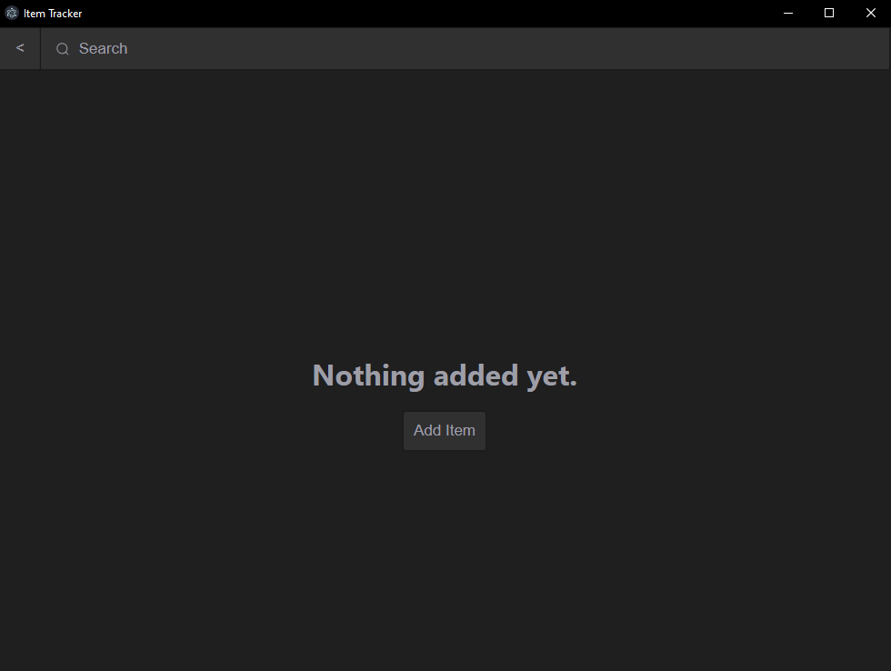
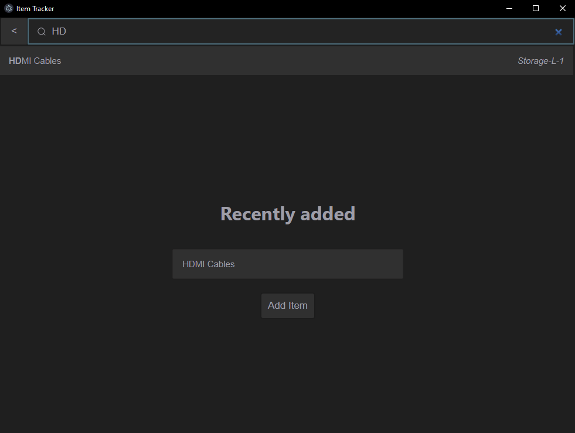

# Item Tracker

Item Tracker is a simple desktop application built using JavaScript and the Electron framework that allows users to organize and manage items.

## Features

**Modern UI**

A clean and intuitive interface designed for ease of use.

<br>

**Search**

Quickly find items with a search system that matches entries based on names and locations.

<br>

**Local Database**

Data is stored locally using SQLite.

**Cross-Platform Support**

This application works on both Windows and macOS.

Note that Linux is not officially supported yet.

## Installation

1. **Clone the repository**:

   ```bash
   git clone https://github.com/AAhmad404/Item-Tracker
   ```
2. **Change directory**:
   ```bash
   cd Item-Tracker
   ```
3. Install dependencies
   ```bash
   npm install
   ```
4. Start the application
   ```bash
   npm start
   ```

## Usage

1. Launch the application.
2. Add items by specifying details such as name, count, location, and an optional image.
3. Use the search feature to find items quickly by name or location.
4. Click on an item’s image to expand it for a closer look.

## Built With

Electron - Framework for building cross-platform desktop apps

SQLite - Lightweight database for local storage

JavaScript - Programming language used

Node.js - Runtime for JavaScript

## Contributing

If you’d like to contribute, please:

1. Create a new branch for your feature or bug fix.

2. Commit your changes and submit a pull request.

## License

This project is licensed under the MIT License. See the [LICENSE.md](LICENSE.md) file for details.

## Acknowledgements

- [Electron](https://www.electronjs.org/)

- [SQLite](https://www.sqlite.org/)

- Open-source community for other libraries/tools used.
